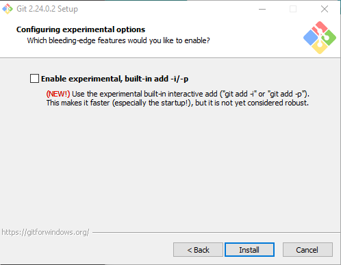
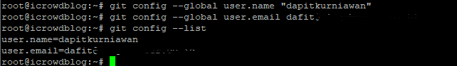
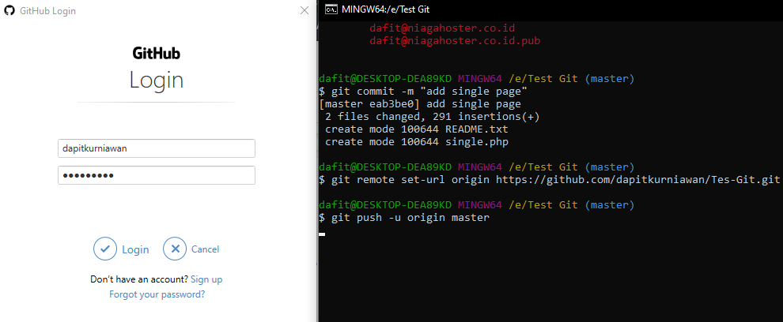

# latihan-vcs

## cara menggunakan git

### membuat folder
instal git

### login git
cari di search lalu login gitbush

### login gitHub 
login gitHub 

### Membuat respositories 
membuat respositories baru

