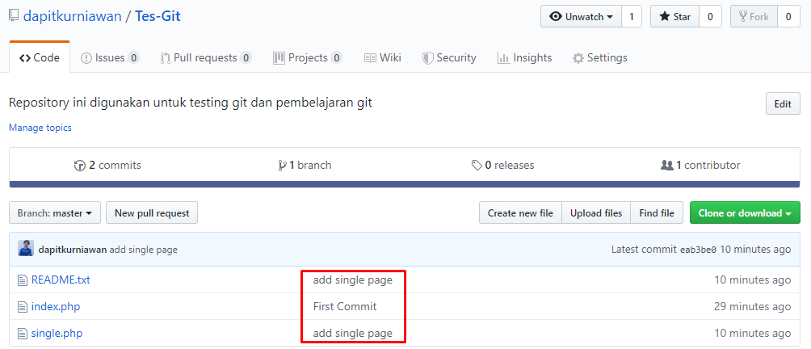

# latihan-vcs

## cara menggunakan git

### membuat folder
instal git

### login git
cari di search lalu login gitbush

### login gitHub 
login gitHub 

### Membuat repository
membuat repository baru

### mengisi judul repository
mengisi judul dan setting repository

### mengecek repository
mengecek repository yang sudah dibuat
